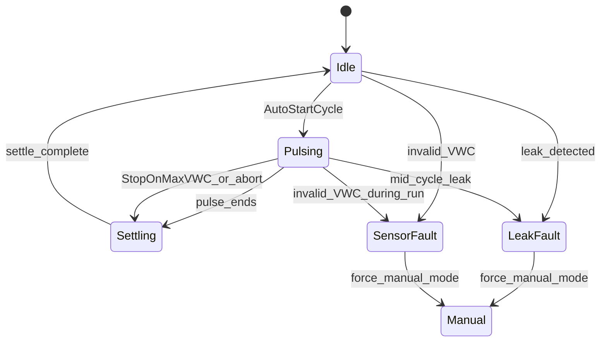

# Home Assistant Drip Control

Home Assistant runs the drip irrigation algorithm when `input_select.irrigation_control_mode` is `auto`. The firmware opens and closes the valve on MQTT command and enforces hard safety limits; it does not decide when to irrigate in normal operation.

See also: [theory_of_operation.md](theory_of_operation.md) (firmware), [ai_tuning_guide.md](ai_tuning_guide.md) (parameter tuning), [schemas/irrigation_cycle_log.md](../schemas/irrigation_cycle_log.md) (cycle events).

---

## Control modes

| Mode | Behavior |
|------|----------|
| `disabled` | No auto cycles; manual buttons only |
| `manual` | Default after deploy; no auto cycles |
| `auto` | HA drip state machine (this document) |
| `firmware_fallback` | Pushes `auto_trigger_enabled: true` to firmware; on-device `resume_vwc` trigger only |

---

## Moisture bands (per sensor)

Each sensor has three VWC thresholds (`input_number` helpers in the package):

| Band | Helper | Role |
|------|--------|------|
| Resume | `irrigation_sensorN_resume_vwc` | Dry enough to start a new dry event (default 35 %) |
| Target | `irrigation_sensorN_target_vwc` | Moisture goal; resets cycle counter when both sensors reach it (default 44 %) |
| Max | `irrigation_sensorN_max_vwc` | Early stop — HA sends `close` during pulse (default 50 %) |

**Auto-start conditions** (all must be true):

- Mode is `auto`, valve idle, controller online
- No leak or sensor fault
- At least one sensor below `resume_vwc`, both below `target_vwc`, both valid (VWC ≥ 1 %)
- Cycles this dry event &lt; `max_cycles_per_event`
- Runtime budgets allow next pulse duration
- Settle period elapsed since last valve state change

---

## State machine



After settling → idle, HA waits `leak_check_delay_min`, then runs post-cycle evaluation and logs `irrigation_cycle_complete`.

---

## Scripts

| Script | Purpose |
|--------|---------|
| `irrigation_sync_firmware` | MQTT `configure` with all timing/limit sliders + `auto_trigger_enabled` |
| `irrigation_begin_cycle` | Snapshot VWC → sync firmware → MQTT `pulse` → increment cycle counter |
| `irrigation_abort_and_close` | MQTT `close` |
| `irrigation_set_leak_fault` | Set leak fault, switch to `manual`, close valve, notify |
| `irrigation_set_sensor_fault` | Set sensor fault, switch to `manual`, close valve, notify |
| `irrigation_post_cycle_evaluate` | Leak/target logic → fire cycle log |
| `irrigation_log_cycle_complete` | `event.fire` `irrigation_cycle_complete` + notification |

---

## Automations

### Sync and config

| Automation | Trigger | Action |
|------------|---------|--------|
| Irrigation Apply Firmware Config | Timing/limit sliders or control mode change | `irrigation_sync_firmware` |
| Irrigation Apply Sensor 0/1 Config | `resume_vwc` slider change | MQTT sensor config |
| Irrigation Sync Firmware On Connect | HA start or controller online | Push sensor configs + full sync |

### Alerts

| Automation | Trigger | Action |
|------------|---------|--------|
| Irrigation Valve Fault Alert | Valve state → `fault` | Notification |
| Irrigation Controller Offline Alert | Controller offline 2 min | Notification |

### Auto control

| Automation | Trigger | Action |
|------------|---------|--------|
| Irrigation Reset Dry Event Counter | Both sensors ≥ target VWC | Reset `counter.irrigation_cycles_this_event` |
| Irrigation Snapshot VWC On Pulsing | Valve → `pulsing` | Record before-VWC |
| Irrigation Auto Start Cycle | Sensor/valve change or every 5 min | `irrigation_begin_cycle` if conditions met |
| Irrigation Stop On Max VWC | Sensor change or every 30 s while pulsing | `irrigation_abort_and_close` if max VWC hit |
| Irrigation Sensor Invalid During Run | VWC &lt; 1 % while pulsing | `irrigation_set_sensor_fault` |
| Irrigation Mid Cycle Leak Check | Start of pulse + half duration | Leak fault if water without moisture gain |
| Irrigation Block Start On Invalid Sensor | VWC &lt; 1 % anytime | Set sensor fault flag |

### Cycle logging

| Automation | Trigger | Action |
|------------|---------|--------|
| Irrigation Record VWC At Cycle End | `pulsing` → `settling` | Record end-VWC |
| Irrigation Post Settle Evaluate | `settling` → `idle` | Delay → `irrigation_post_cycle_evaluate` |
| Irrigation Snapshot VWC At 60 Minutes | `settling` → `idle` | Record 60 m VWC for AI analysis |

### Safety backstop

| Automation | Trigger | Action |
|------------|---------|--------|
| Irrigation Stuck Valve Overrun | Every 1 min while pulsing | Force close if pulsing &gt; `max_single_run_min + 2 min` |

This HA overrun backstop is separate from firmware E001 (emergency 7200 s pulse cap).

---

## Leak detection

**Post-settle** (`irrigation_post_cycle_evaluate`):

```
gallons_estimated >= min_gallons_for_leak_check
AND max(delta_sensor_0, delta_sensor_1) < min_vwc_delta
→ outcome: leak_suspect → irrigation_set_leak_fault
```

**Mid-cycle** (at half of `duration_min`, minimum 3 min):

Same logic but `min_delta` threshold is 25 % of `min_vwc_delta`.

**Outcomes:**

| Outcome | Meaning |
|---------|---------|
| `target_reached` | Both sensors ≥ target VWC; reset dry-event counter |
| `leak_suspect` | Water delivered without expected moisture increase |
| `normal` | Cycle complete, target not yet reached |

---

## Resolved template entities

The package defines `*_resolved` template sensors that read from either short MQTT Discovery IDs (`sensor.irrigation_sensor_0_vwc`) or legacy long IDs (`sensor.irrigation_controller_irrigation_*`). **Automations use resolved entities.** Dashboards should migrate to resolved IDs for forward compatibility.

Key resolved entities:

| Entity | Purpose |
|--------|---------|
| `sensor.irrigation_sensor_0_vwc_resolved` | Zone 0 moisture |
| `sensor.irrigation_sensor_1_vwc_resolved` | Zone 1 moisture |
| `sensor.irrigation_valve_state_resolved` | `idle` / `pulsing` / `settling` / `fault` |
| `binary_sensor.irrigation_controller_online_resolved` | MQTT connectivity |
| `sensor.irrigation_operational_status` | Combined HA status (idle, irrigating, leak_fault, etc.) |
| `sensor.irrigation_valve_phase` | Live countdown during pulse/settle |
