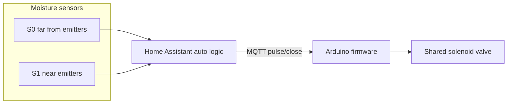
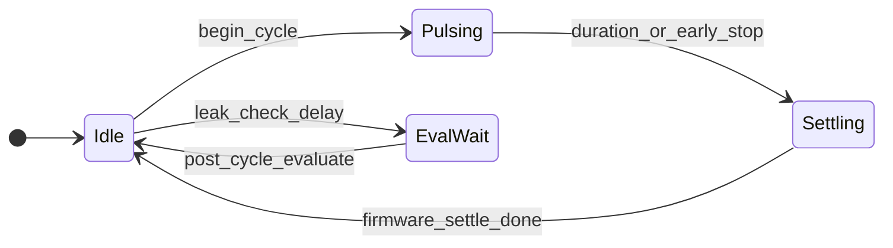
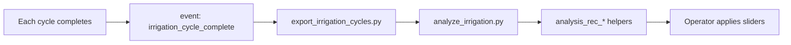

# Irrigation System Specification

**Start here.** This document defines what the system is for, what it is not for, and how every major piece maps to that purpose.

For daily use see [operator_guide.md](operator_guide.md). For implementation detail see [ha_drip_control.md](ha_drip_control.md) (Home Assistant) and [theory_of_operation.md](theory_of_operation.md) (firmware).

---

## Purpose

Keep soil moisture within a **programmable window** by opening a **single shared valve** in metered pulses when soil is too dry, and stopping when moisture reaches target or a safety limit is hit.

The system is designed to run **unattended**. If the valve is open (or water has been delivered) and soil moisture does not increase as expected, that is an **alarm condition** — irrigation stops and auto mode is disabled until cleared.

Cycle data is logged and exportable so an AI agent (or human) can analyze performance and recommend setting changes. Recommendations are applied manually; nothing auto-tunes in production.

### In one sentence

Pulse water when moisture is below the resume band; stop when both sensors reach target (or a safety rule fires); alarm if water runs without moisture gain; log every cycle for offline tuning.

---

## Non-goals

| Not in scope | Notes |
|--------------|-------|
| Multi-valve zoning | One solenoid; sensor placement defines zones |
| Weather / forecast integration | Future; not implemented |
| Automatic setting changes | AI recommends; operator applies |
| Per-zone independent schedules | All irrigation is moisture-driven |

---

## Physical model

**Sensor roles (asymmetric by design):**

| Sensor | Placement | Role in control |
|--------|-----------|-----------------|
| S0 | Far from emitters | **Target driver** — slow to wet; stopping when S0 ≥ target ends the cycle early |
| S1 | Near emitters | **Saturation guard** — fast to wet; stopping when S1 ≥ max prevents over-watering near the hose |

S0 `max_vwc` is stored but **not** used as an early-stop trigger during pulses. S1 `target_vwc` is used for dry-event completion (both sensors must reach target to reset the cycle counter).

---

## Moisture window model

Each sensor has three VWC thresholds (%, volumetric water content):

| Band | Helper | Typical default | Meaning |
|------|--------|-----------------|---------|
| **Resume** | `irrigation_sensorN_resume_vwc` | 35 % | Dry enough to start irrigating (new dry event) |
| **Target** | `irrigation_sensorN_target_vwc` | 44 % | Moisture goal for this zone |
| **Max** | `irrigation_sensorN_max_vwc` | 50 % | Saturation ceiling (S1 early-stop only) |

### Dry event

A **dry event** begins when either sensor drops below **resume** and ends when **both** sensors are at or above **resume**. During one dry event:

- Home Assistant may run multiple **cycles** (pulse → settle → evaluate → wait → repeat).
- `counter.irrigation_cycles_this_event` counts how many cycles have **started** (increments on every `begin_cycle`, including manual).
- `input_number.irrigation_max_cycles_per_event` is the **cap**; auto blocks when counter ≥ cap.
- Lowering the cap does **not** reset the counter — counter can exceed the new limit until reset or both sensors reach target.
- The counter resets when both sensors ≥ target (live automation), on manual **Reset Dry Event Counter**, when post-cycle evaluation reports `target_reached`, or when **Apply Default Settings** / **Enable Auto Test Mode** runs.

### Cycle (one irrigation run)

1. **Pulse** — valve open up to `irrigation_duration_min` (firmware enforces `max_single_run_min`).
2. **Settle** — valve closed; firmware waits `irrigation_settle_min` (moisture redistributes).
3. **Leak-check delay** — HA waits `irrigation_leak_check_delay_min` after idle before measuring.
4. **Evaluate** — compare moisture gain vs water delivered; log `irrigation_cycle_complete` event.
5. **Auto-start** — if still in auto and moisture below target, schedule next cycle (polls every 5 min when ready).

---

## Control modes

| Mode | Who decides when to irrigate |
|------|----------------------------|
| `manual` | Operator (dashboard buttons) — **default after deploy** |
| `auto` | Home Assistant drip algorithm (normal production) |
| `disabled` | No automatic cycles; manual still works |
| `firmware_fallback` | Firmware only — pulses when any sensor &lt; `resume_vwc` (emergency / legacy) |

**Config authority:** All timing and limits are Home Assistant sliders pushed to the controller via MQTT `configure`. The controller persists the last config to flash.

---

## Alarms

| Alarm | Trigger | What stops | How to clear | Logged |
|-------|---------|------------|--------------|--------|
| **Leak suspect** | Water delivered (≥ min gallons) but moisture gain &lt; `min_vwc_delta` (mid-cycle or post-cycle) | Auto → manual, valve closed | Clear Leak Fault; fix plumbing; return to manual test | `irrigation_cycle_complete` outcome `leak_suspect` |
| **Sensor fault** | VWC &lt; 1 % (disconnected / invalid probe) | Auto → manual, valve closed | Clear Sensor Fault; fix probe | Cycle event + notification |
| **Valve fault E001** | Pulse exceeded hardware stuck-valve cap (24 h) | Firmware fault state | Clear Valve Fault | Telemetry `error_code` |
| **Valve fault E002** | Rolling-hour valve-open time ≥ `max_runtime_hour_min` | Firmware fault state | Clear Valve Fault; wait for hour window or reboot | Telemetry `error_code` |
| **Valve fault E003** | Rolling-day valve-open time ≥ `max_runtime_day_min` | Firmware fault state | Clear Valve Fault; wait for day window or reboot | Telemetry `error_code` |
| **Valve fault E004** | Pulse denied (not configured, not idle, or budget exhausted) | Firmware fault state | Clear Valve Fault; fix config/budget | Telemetry `error_code` |
| **Controller offline** | No MQTT ≥ 2 min | Auto cannot start | Restore network / controller | HA notification |
| **MQTT failsafe** | MQTT down ≥ `failsafe_disconnect_min` | Firmware force-closes valve | Restore MQTT | Firmware log |
| **HA overrun backstop** | Pulsing longer than `max_single_run_min + 2 min` | HA force-closes valve | Investigate stuck valve / config | HA notification |

**Important:** Firmware faults **latch** until `clear_fault` — waiting for a time window to roll does not clear the fault by itself.

---

## Operator settings

### Minimum (set these first)

| Setting | Entity | Role |
|---------|--------|------|
| Control mode | `input_select.irrigation_control_mode` | `manual` for testing, `auto` for production |
| Pulse length | `input_number.irrigation_duration_min` | How long each cycle may run |
| Settle time | `input_number.irrigation_settle_min` | Gap after valve closes before re-evaluation |
| S0 resume / target | `irrigation_sensor0_resume_vwc`, `irrigation_sensor0_target_vwc` | When to start / goal for far zone |
| S1 resume / target / max | `irrigation_sensor1_resume_vwc`, `irrigation_sensor1_target_vwc`, `irrigation_sensor1_max_vwc` | Near zone bands + saturation stop |
| Max cycles per dry event | `input_number.irrigation_max_cycles_per_event` | Cap repeats before giving up |

### Advanced (safety budgets and leak tuning)

| Setting | Entity | Role |
|---------|--------|------|
| Max runtime per hour | `irrigation_max_runtime_hour_min` | Rolling-hour budget; **disabled when ≤ Duration** (both 60 = off) |
| Max runtime per day | `irrigation_max_runtime_day_min` | Cumulative daily budget |
| Max single run | `irrigation_max_single_run_min` | Firmware cap per pulse; set ≥ duration for long runs |
| MQTT failsafe | `irrigation_failsafe_disconnect_min` | Close valve if HA link lost |
| Min VWC delta | `irrigation_min_vwc_delta` | Leak detection sensitivity |
| Leak check delay | `irrigation_leak_check_delay_min` | Wait after settle before leak measurement |
| Min gallons for leak check | `irrigation_min_gallons_for_leak_check` | Ignore leak logic below this volume |
| System flow rate | `irrigation_system_gph` | Gallons estimate for leak math |

### Internal / tuning pipeline (do not edit unless you know why)

Cycle snapshot helpers (`irrigation_cycle_vwc_*`), analysis recommendation helpers (`irrigation_analysis_rec_*`), test override (`irrigation_auto_block_override`), settings revision (`irrigation_settings_revision`). See [feature_inventory.md](feature_inventory.md).

---

## Tuning pipeline

Details: [data_extraction.md](data_extraction.md), [ai_tuning_guide.md](ai_tuning_guide.md), [schemas/irrigation_cycle_log.md](../schemas/irrigation_cycle_log.md).

---

## Document map

| Layer | Document | Audience |
|-------|----------|----------|
| L0 — What & why | **This file** | Everyone |
| L1 — Daily use | [operator_guide.md](operator_guide.md) | Operator |
| L2 — HA algorithm | [ha_drip_control.md](ha_drip_control.md) | Implementer |
| L2 — Firmware | [theory_of_operation.md](theory_of_operation.md) | Implementer |
| L3 — Data & AI | [data_extraction.md](data_extraction.md), [ai_tuning_guide.md](ai_tuning_guide.md), schemas | Analyst / AI agent |
| Inventory | [feature_inventory.md](feature_inventory.md) | Audit / simplification |
| Audit | [audit_report.md](audit_report.md) | Phase-2 backlog |
